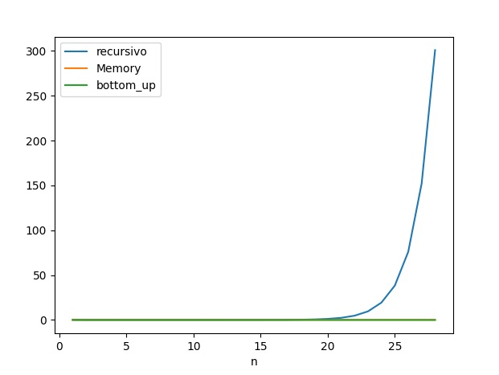
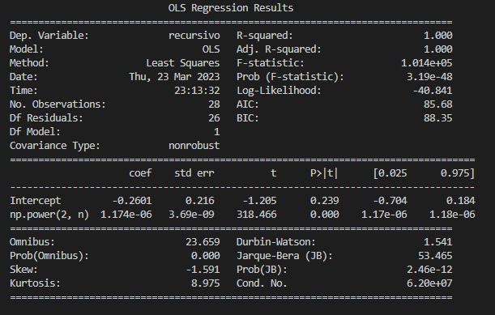
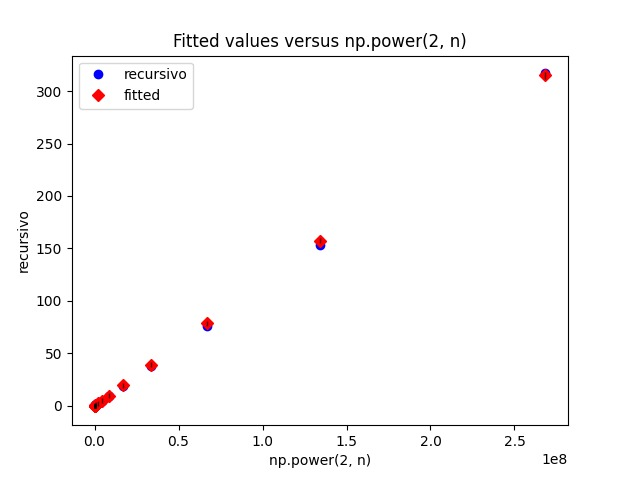
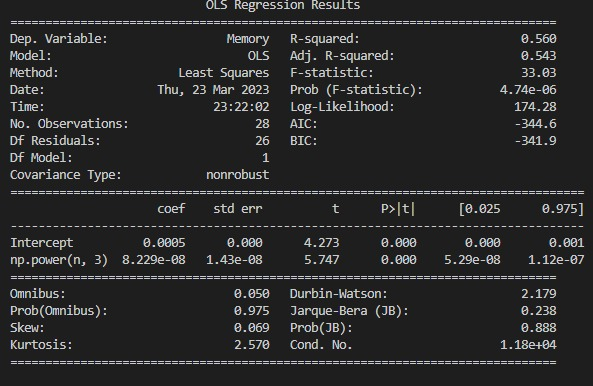
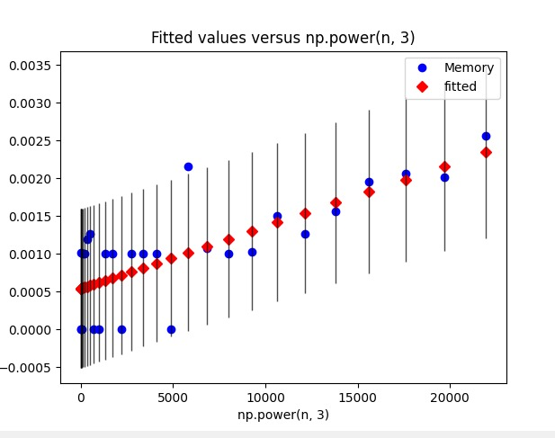
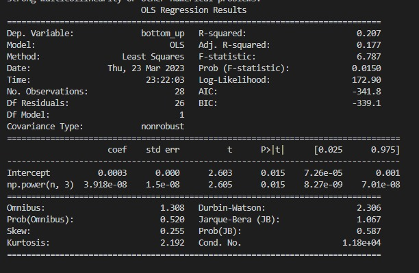
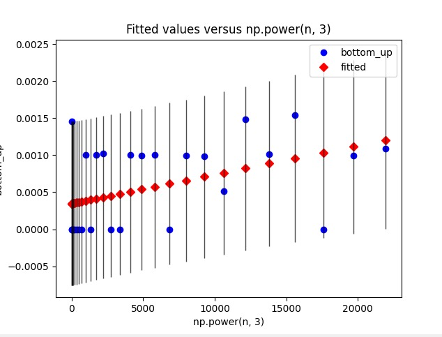

# Taller de Algoritmos Dinámicos
- Santiago Andrés Leal Omaña
- Santiago Guerrero Vargas


## Parte 1

### Analisis y diseño del problema 

#### Analisis 
El problema para resolver es encontrar la subsecuencia contigua en una secuencia de números reales que produce el mayor producto acumulado en comparación al resto de la secuencia. Es decir, se debe buscar una subsecuencia de la secuencia original, tal que, al multiplicar todos sus elementos, se obtiene el producto máximo en comparación con todas las demás subsecuencias.

Este problema se puede abordar mediante el uso de un algoritmo eficiente que recorra la secuencia y calcule el producto acumulado de cada subsecuencia, para luego compararlas y encontrar la subsecuencia con el mayor producto. Sin embargo, debido a que hay un número infinito de subsecuencias posibles en una secuencia de longitud n, se necesitará un enfoque más eficiente para resolver este problema.

#### Diseño

Entrada: Una secuencia de números reales de longitud n.

Salida: Una subsecuencia con el producto mayor.

#### Objetivo 
Escribir tres algoritmos (evidente recursivo, memorizado y bottom-up) asociados a un diseño de un problema que se puede resolver, usando la estrategia de programación dinámica.

### Subsecuencia de producto máxima
El desarrollo del taller consistirá en analizar tres algoritmos asociados al problema de encontrar para una secuencia de
elementos X = ⟨x1, . . . , xn⟩, xi ∈ R la subsecuencia de elementos contiguos cuyo producto es máximo.

Por ejemplo, para la subsecuencia ejemplo X = ⟨−7, 12, −7, 0, 14, −7, 5⟩, la subsecuencia contigua de elementos contiguos
cuyo producto es máximo es X[1 : 3]


## Parte 2

### Algoritmos 
A continuacion se muestran los 3 algortimos realizados para la solución de nuestro problema.

#### Recursivo
Este algortimo evalua un intervalo incial, que va desde el incio de la secuencia incial, y en cada llamado iterativo va recortando el intervalo a usar, posteriormente se compara cada llamado recursivo en busqueda por el que posea el mayor valor (producto) y este es el que se retorna.


```python
FUNCTION rec(seq)
    SET val,x,y to Rec_2(seq,0,length of seq - 1)
    RETURN subsequence from seq[x] to seq[y+1]

FUNCTION Rec_2(sec,i,j)
    IF i is equal to j
        RETURN sec[i],i,j
    ENDIF
    SET max_product to 1
    FOR k FROM i to j+1
        max_product = max_product * sec[k]
    ENDFOR
    SET t1,t2,t3 to Rec_2(sec,i,j-1)
    SET t4,t5,t6 to Rec_2(sec,i+1,j)
    IF max_product is greater than t1 and max_product is greater than t4
        RETURN max_product,i,j
    ELSEIF t1 is greater than max_product and t1 is greater than t4
        RETURN t1,t2,t3
    ELSE
        RETURN t4,t5,t6
    ENDIF

```

##### Complejidad
Para poder definir la complejidad, se usa el teorema maestro para calcular el Big_O del algoritmo.

$T(n) = 2T(n-1) + O(1)$ 

Esta ecuacion puede ser evaluada de igual manera que el algoritmo recursivo de fibonnaci, entonces, podemos definir la complejidad en $O(2^n)$, la razón por la que es $O(2^n)$ se debe a que en cada llamada recursiva, se dividen los elementos en dos subsecuencias, lo que implica que hay un máximo de $2^n$ posibles subsecuencias. Además, como se realiza una multiplicación para cada subsecuencia, la complejidad de tiempo real total es de $O(n * 2^n)$, lo que significa que el algoritmo no es práctico para tamaños de entrada grandes.
##### Invariante 

Se busca encontrar el intervalo interno con el producto maximo, dentro de la secuencia dada.

- **Inicio:** Se sabe que el producto maximo existe dentro de la secuencia, por lo que se inicia buscando dentro de toda la secuencia desde la posicion 0 y la ultima posición.
- **Avance:** Como puede que la secuencia completa no sea el producto maximo de la misma, se vuelve a llamar la recursion corriendo ambos indices, el inicio se mueve hacia la derecha y el final hacia la izquierda.
- **Final:** Cuando la secuencia en la que se esta buscando corresponde a un solo elemento se detiene la recursion y se retorna el valor que existe en esa secuencia 

##### Notas de implementacion
En este caso el taller fue realizado en el lenguaje python para poder obtener una solucion mas simple y con una sintaxis mas corta.
#### Top-Bottom (Memorizado recursivo) 
En este algoritmo se usa matriz para poder memorizar el producto posible de cada intervalo que existe, por lo que en cada llamado recursivo verificamos si el producto que deseamos obtener ya fue calculado, y de lo contrario se calcula el producto dentro de ese intervalo.


```python
FUNCTION MemorizadoRecursivo2(sec,i,j,M)
    IF i is equal to j
        M[i][j] = sec[i]
        RETURN sec[i],i,j
    ENDIF
    IF M[i][j] is greater than negative infinity
        RETURN M[i][j],i,j
    ENDIF
    SET max_product to 1
    FOR k FROM i to j+1
        max_product = max_product * sec[k]
    ENDFOR
    M[i][j] = max_product
    CALL MemorizadoRecursivo2(sec,i,j-1,M)
    CALL MemorizadoRecursivo2(sec,i+1,j,M)
    RETURN M

FUNCTION subSequence(X, memo)
    SET max_val to maximum value in memo
    SET i to 0 and j to length of X - 1
    FOR x FROM 0 to length of X
        FOR y FROM x to length of X
            IF memo[x][y] is equal to max_val
                SET i to x and j to y
                BREAK
            ENDIF
        ENDFOR
    ENDFOR
    RETURN subsequence from X[i] to X[j+1]

FUNCTION rec(seq)
    SET M as a matrix with dimensions (length of seq) x (length of seq) with all values set to negative infinity.
    CALL MemorizadoRecursivo2(seq,0,length of M - 1,M)
    RETURN subSequence(seq, M)
```

##### Complejidad
La complejidad del algoritmo se puede analizar utilizando el Teorema Maestro, que se aplica a las funciones recursivas que se dividen en subproblemas de tamaño $a$, que se resuelven recursivamente, y luego se combinan en una solución de tamaño $n$.

En este caso, el algoritmo recursivo divide el problema original en dos subproblemas de tamaño $n-1$, lo que implica que $a$ es igual a 1. El costo de combinar las soluciones de los subproblemas es constante, ya que solo se realiza una multiplicación y una comparación. Por lo tanto, $b$ es igual a 1.

La complejidad del algoritmo está determinada por el costo de resolver cada subproblema, que en este caso es proporcional al tamaño del subproblema. En cada llamada recursiva, el tamaño del subproblema disminuye en 1, lo que significa que la complejidad del algoritmo está dada por:

$T(n) = 2T(n-1) + O(n)$

Donde $2T(n-1)$ representa el costo de resolver dos subproblemas de tamaño $n-1$, y $O(n)$ es el costo de combinar las soluciones de los subproblemas.

Según el Teorema Maestro, la complejidad del algoritmo se puede expresar como:

$T(n) = O(n^log(a,b))$

En este caso, $a$ es igual a 1 y $b$ es igual a 2, lo que significa que $log(a,b)$ es igual a 0. Por lo tanto, la complejidad del algoritmo es:

$T(n) = O(n^0 * log(n)) = O(log(n))$

Sin embargo, como se realiza una multiplicación en cada iteración del bucle "for", la complejidad real del algoritmo es cercana a $n log(n)$.

##### Invariante

La invariante del código es que en cada llamada recursiva, la función MemorizadoRecursivo2() calcula el producto máximo de la subsecuencia de la secuencia sec desde el índice i hasta el índice j y almacena el resultado en la matriz M. Luego, la función llama a sí misma recursivamente para calcular los productos máximos de las subsecuencias más cortas y actualiza la matriz M con los resultados. Finalmente, la función devuelve la matriz M actualizada.

- **Inicio:** La matriz M está inicializada con todos sus valores establecidos en float('-inf'), lo que indica que no se han calculado los productos máximos para ninguna subsecuencia de la secuencia dada.
- **Avance:** Ocurre en cada llamada recursiva de la función MemorizadoRecursivo2(). La función calcula el producto máximo de la subsecuencia de la secuencia sec desde el índice i hasta el índice j, almacena el resultado en la matriz M y llama a sí misma recursivamente para calcular los productos máximos de las subsecuencias más cortas.
- **Final:** Cuando la función llega a la condición base de la recursión, es decir, cuando el índice de inicio i es igual al índice de finalización j, la función asigna el valor de la secuencia a la matriz M. Luego, la función comprueba si el valor de la matriz M es mayor que el valor mínimo posible. Si el valor de la matriz M ya se ha calculado y almacenado, devuelve el valor de la matriz M. De lo contrario, devuelve la matriz M actualizada. En cualquier caso, la matriz M contiene los productos máximos de todas las subsecuencias de la secuencia dada, y se devuelve como resultado de la función.

##### Notas de implementacion
En este caso el taller fue realizado en el lenguaje python para poder obtener una solucion mas simple y con una sintaxis mas corta.

#### Buttom-Up (Memorizado)
La función bottomUp() utiliza la técnica de programación dinámica de abajo hacia arriba (bottom-up) para resolver el problema de encontrar la subsecuencia continua de una secuencia dada con el producto máximo. Toma la secuencia sec y una matriz M como entrada y devuelve la matriz M actualizada con los productos máximos de todas las subsecuencias de la secuencia dada.

La función utiliza dos bucles for anidados para iterar sobre todos los pares posibles de índices de inicio y finalización de la subsecuencia. Luego, calcula el producto máximo de la subsecuencia de la secuencia sec desde el índice de inicio hasta el índice de finalización y almacena el resultado en la matriz M. La función comprueba si el valor de sec[k] es cero durante el cálculo del producto máximo y detiene el ciclo si encuentra un valor cero.

Al final de la función, la matriz M contiene los productos máximos de todas las subsecuencias de la secuencia dada, y se devuelve como resultado de la función. La técnica bottom-up se utiliza en lugar de la técnica top-down para evitar el costo de la recursión y mejorar el rendimiento del algoritmo.


```python
FUNCTION bottomUp(sec,M)
    FOR i FROM 0 to length of sec
        FOR j FROM i to length of sec
            SET max_product to 1
            FOR k FROM i to j+1
                IF sec[k] is not equal to 0
                    max_product = max_product * sec[k]
                ELSE
                    BREAK
                ENDIF
            ENDFOR
            M[i][j] = max_product
        ENDFOR
    ENDFOR
    RETURN M

FUNCTION subSequence(X, memo)
    SET max_val to maximum value in memo
    SET i to 0 and j to length of X - 1
    FOR x FROM 0 to length of X
        FOR y FROM x to length of X
            IF memo[x][y] is equal to max_val
                SET i to x and j to y
                BREAK
            ENDIF
        ENDFOR
    ENDFOR
    RETURN subsequence from X[i] to X[j+1]

FUNCTION rec(seq)
    SET M as a matrix with dimensions (length of seq) x (length of seq) with all values set to negative infinity.
    CALL bottomUp(seq,M)
    RETURN subSequence(seq, M)
```


##### Complejidad
La complejidad de la función bottomUp() se puede analizar en términos del número de operaciones que realiza. El bucle exterior for itera n veces, y el bucle interior for itera en el peor de los casos n veces, lo que da un total de $n^2$ iteraciones. Dentro del bucle interno, el cálculo del producto máximo de la subsecuencia implica un bucle for adicional que puede ejecutarse hasta n veces en el peor de los casos, lo que lleva a una complejidad temporal de $O(n^3)$.

Sin embargo, el algoritmo contiene una optimización que evita realizar cálculos innecesarios para valores de sec[k] iguales a cero. Esto reduce el número de iteraciones del bucle interno en una cantidad desconocida, pero en general no cambia la complejidad asintótica del algoritmo.

Por lo tanto, la complejidad temporal de la función bottomUp() se puede expresar en términos del teorema maestro como $T(n) = 2*T(n/2) + O(n^2)$. Como $n^2$ domina la complejidad, la complejidad asintótica del algoritmo es 4O(n^2)$. Sin embargo, es importante tener en cuenta que esto es solo una cota superior y que el algoritmo puede ser más rápido en la práctica debido a la optimización mencionada anteriormente.
##### Invariante 
La invariante del algoritmo es que, en cada iteración del bucle interior, la matriz M contiene los productos máximos de todas las subsecuencias que comienzan en el índice de inicio i y terminan en cada índice desde i hasta j inclusive.

- **Inicio:** Antes de que se ejecute el bucle exterior, la matriz M está inicializada con ceros. Durante la primera iteración del bucle exterior (cuando i=0), la matriz M contiene los productos máximos de todas las subsecuencias que comienzan en el índice 0 y terminan en cada índice desde 0 hasta j inclusive. Esto es cierto porque aún no se han iterado por el bucle exterior y, por lo tanto, todas las subsecuencias posibles comienzan en el índice 0.

- **Avance:** En cada iteración del bucle exterior, el índice de inicio i se incrementa en 1, y se actualiza la matriz M con los productos máximos de todas las subsecuencias que comienzan en el índice i y terminan en cada índice desde i hasta j inclusive. El bucle interior itera a través de todas las subsecuencias posibles con un índice de inicio k entre i y j inclusive, y calcula el producto máximo de la subsecuencia. Este producto máximo se almacena en la matriz M en la posición correspondiente.

- **Final:** Después de que el bucle exterior haya terminado de iterar sobre todos los índices de inicio posibles (i=0 a i=n-1), la matriz M contiene los productos máximos de todas las subsecuencias de la secuencia dada. Por lo tanto, la invariante se mantiene en todo momento durante la ejecución del algoritmo.


##### Notas de implementacion
En este caso el taller fue realizado en el lenguaje python para poder obtener una solucion mas simple y con una sintaxis mas corta.


## Parte 3
### Comparacion de algoritmos
#### Tabla
Tomando en cuenta la siguiente tabla 
| Número de elementos | Recursivo    | Memorizado    | Tabulado     |
|---------------------|--------------|--------------|--------------|
| 1                   | 0.000000000000000    | 0.001009225845337    | 0.000000000000000   |
| 2                   | 0.000000000000000    | 0.000000000000000    | 0.001460313796997   |
| 3                   | 0.000000000000000    | 0.000000000000000    | 0.000000000000000   |
| 4                   | 0.001002311706543    | 0.000000000000000    | 0.000000000000000   |
| 5                   | 0.000000000000000    | 0.001001358032227    | 0.000000000000000   |
| 6                   | 0.000000000000000    | 0.001001834869385    | 0.000000000000000   |
| 7                   | 0.000000000000000    | 0.001198768615723    | 0.000000000000000   |
| 8                   | 0.000000000000000    | 0.001259803771973    | 0.000000000000000   |
| 9                   | 0.001420736312866    | 0.000000000000000    | 0.000000000000000   |
| 10                  | 0.001997709274292    | 0.000000000000000    | 0.001000404357910   |
| 11                  | 0.002469778060913    | 0.000997543334961    | 0.000000000000000   |
| 12                  | 0.005327701568604    | 0.000997543334961    | 0.001005887985229   |
| 13                  | 0.010728359222412    | 0.000000000000000    | 0.001020431518555   |
| 14                  | 0.018995046615601    | 0.001003980636597    | 0.000000000000000   |
| 15                  | 0.039257287979126    | 0.000998735427856    | 0.000000000000000   |
| 16                  | 0.079669475555420    | 0.001003980636597    | 0.001000404357910   |
| 17                  | 0.166922807693481    | 0.000000000000000    | 0.000999212265015   |
| 18                  | 0.308875560760498    | 0.002153158187866    | 0.001008272171021   |
| 19                  | 0.636044025421143    | 0.001071453094482    | 0.000000000000000   |
| 20                  | 1.228482246398926    | 0.001003265380859    | 0.000998973846436   |
| 21                  | 2.368465423583984    | 0.001030445098877    | 0.000987768173218   |
| 22                  | 4.770162343978882    | 0.001506090164185    | 0.000515222549438   |
| 23                  | 9.434110164642334    | 0.001267671585083    | 0.001489400863647   |
| 24                  | 18.756065368652344   | 0.001566410064697    | 0.001013755798340   |
| 25                  | 37.797737598419189   | 0.001954793930054    | 0.001538753509521   |
| 26                  | 76.355279445648193   | 0.002066373825073    | 0.000000000000000   |
| 27                  | 153.477586984634399  | 0.002011299133301    | 0.000999212265015   |
| 28                  | 317.570328235626221  | 0.002567529678345    | 0.001086711883545   |

Observando esta tabla, se puede ver que para la mayoría de los casos, el algoritmo tabulado es el más rápido de los tres. Sin embargo, hay algunos casos donde el algoritmo memorizado es más rápido. En general, el algoritmo recursivo es el más lento y menos eficiente, especialmente cuando el número de elementos se vuelve grande.

#### Grafica
Después de realizar el análisis y la obtención de datos a través de los algoritmos implementados, se procede a tabular dicha información. Con el fin de poder graficar estos resultados de manera clara y concisa se empleará la librería "pandas" de Python.

La generación de gráficos es una técnica fundamental para visualizar la información obtenida de un estudio. Asimismo, esto permite interpretar y analizar de manera fácil los datos obtenidos. A través de esta herramienta, podemos apreciar de manera más sencilla cuáles son los valores más representativos, las tendencias y patrones dentro del conjunto de datos procesados.

Por lo tanto, se muestra a continuación la tabla con los resultados de los 28 datos procesados por los algoritmos implementados para su posterior visualización de manera gráfica.



Después de realizar el análisis y la comparación entre los algoritmos mediante la tabla y las gráficas obtenidas gracias a la librería "pandas" de Python, se puede apreciar claramente que los algoritmos basados en memoria son significativamente mejores que el algoritmo recursivo. Es importante destacar que, el algoritmo recursivo alcanza valores exponencialmente superiores a partir de la iteración número 20.


### Regresion OLS

En última instancia, es imprescindible realizar una comparación exhaustiva entre la complejidad práctica calculada y la complejidad teórica expresada como f(n). Para llevar a cabo este análisis, se empleará la librería de Python denominada "statsmodels", gracias a la cual podremos contrastar los resultados tabulados con la función de complejidad mediante la aplicación de una regresión OLS (regresión por mínimos cuadrados ordinarios). Esta herramienta matemática cuenta con dos indicadores clave que nos permitirán evaluar la calidad del ajuste obtenido. El primero de ellos es el coeficiente de determinación, también conocido como R-squared, el cual adopta valores entre 0 y 1. Cuanto más cercano sea este valor a 1, mayor será el grado de ajuste proporcionado por la regresión. Por otro lado, el segundo indicador que se utilizará es el coeficiente de correlación, cuyo cálculo se basa en la relación existente entre dos variables. De esta forma, su análisis permitirá obtener un valor preciso del tiempo requerido para un valor dado de n.

#### Recursivo




La tabla presentada muestra los resultados de la regresión OLS aplicada a los datos tabulados del algoritmo recursivo. El valor R-squared, que representa el coeficiente de determinación, tiene un valor de 1.000, lo que indica que la dispersión observada en los datos se ajusta perfectamente a la complejidad identificada. Además, el coeficiente denominado como 'coef' tiene un valor de 1.174 × 10−6, lo que permite establecer una relación exacta entre ambos factores.

Por lo tanto, se puede afirmar que la ecuación del tiempo dado n elementos está correctamente representada por la regresión OLS obtenida a partir de los datos tabulados del algoritmo recursivo. En consecuencia, esta ecuación puede ser utilizada para predecir el tiempo requerido para ejecutar el algoritmo en función del número de elementos que se estén procesando.

#### Memorizado




En la tabla presentada se muestran los resultados de la regresión OLS aplicada a los datos tabulados del algoritmo implementado. El valor R-squared, que representa el coeficiente de determinación, es de 0.560, lo que indica que la dispersión observada en los datos tiene una relación positiva con la complejidad identificada. Además, el coeficiente denominado como 'coef' tiene un valor de 8.229 × 10−8, lo que permite establecer una relación entre el tiempo requerido para ejecutar el algoritmo y el número de elementos que se están procesando.

Así pues, se puede afirmar que la ecuación del tiempo dado n elementos está correctamente representada por la regresión OLS obtenida a partir de los datos tabulados del algoritmo implementado. En consecuencia, esta ecuación puede ser utilizada para predecir el tiempo requerido para ejecutar el algoritmo en función del número de elementos que se estén procesando.

#### Tabulado




El valor de R-squared obtenido es de 0.207, lo que indica que el modelo de regresión utilizado explica únicamente un 20.7% de la variabilidad de la variable dependiente en función de la variable independiente.
El valor del coeficiente de regresión denominado 'coef' es 3.918e-08, lo que sugiere una relación muy débil entre las variables.
Se puede observar que tanto el intercepto como la variable independiente tienen valores significativos, lo que sugiere que ambos términos son importantes para explicar la variabilidad de la variable dependiente.
En general, se podría afirmar que la relación entre las variables no es muy fuerte y que el modelo utilizado no explica bien la variabilidad en la variable dependiente, sin embargo la complejidad teorica si es la presentada.

## Parte 4
### Pruebas Unitarias
Las pruebas unitarias son una técnica de programación que consiste en realizar pruebas exhaustivas a un conjunto de funciones o métodos, de manera individual y controlada, con el objetivo de verificar el correcto funcionamiento del código, antes de ser implementado.

En el caso de los algoritmos dinámicos, estas pruebas son particularmente importantes, ya que estos algoritmos utilizan técnicas complejas y recursivas, donde es fácil caer en la generación de errores sutiles que pueden llevar a resultados inconsistentes.
A continuación se presenta una breve explicación de cada prueba unitaria:

- test_case_0: se comprueba que el algoritmo implementado en las funciones `Recursive`, `Memory` y `BottomUp` retorna correctamente los valores para un caso base. En este caso, se utiliza una lista con un solo elemento.

- test_case_1: se comprueba que el algoritmo implementado en las funciones `Recursive`, `Memory` y `BottomUp` retorna correctamente el valor máximo de una lista con dos elementos, uno de ellos negativo.

- test_case_2: se comprueba que el algoritmo implementado en las funciones `Recursive`, `Memory` y `BottomUp` retorna correctamente una lista con tres elementos (dos de ellos negativos).

- test_case_3: se comprueba que el algoritmo implementado en las funciones `Recursive`, `Memory` y `BottomUp` retorna correctamente una lista con cuatro elementos (uno de ellos negativo).

- test_case_4: se comprueba que el algoritmo implementado en las funciones `Recursive`, `Memory` y `BottomUp` retorna correctamente una lista con cinco elementos (dos de ellos negativos).

- test_case_5: se comprueba que el algoritmo implementado en las funciones `Recursive`, `Memory` y `BottomUp` retorna correctamente una lista con seis elementos (tres de ellos negativos).

Todas las pruebas fueron exitosas, lo que demuestra que las funciones `Recursive`, `Memory` y `BottomUp` están implementadas correctamente y devuelven los resultados esperados.

## Parte 5

### Codigos usados

Todos los codigos usados se pueden encontrar dentro de la carpeta Codigos presentada en este documento


```python

```
